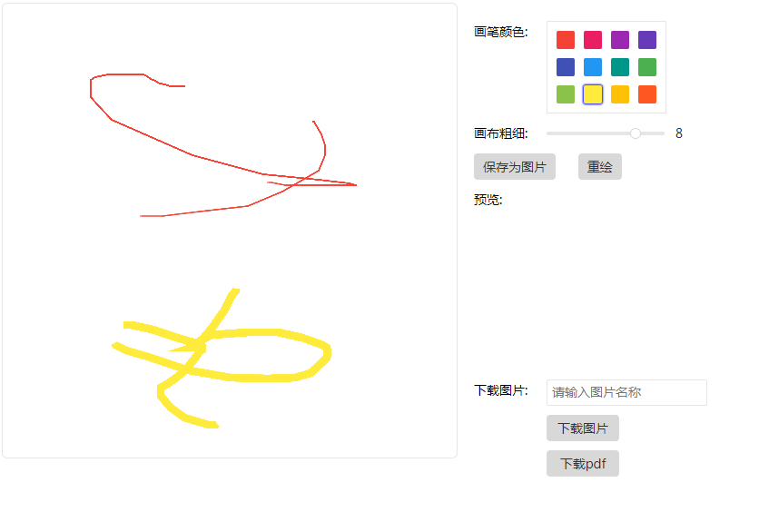

# 描述
canvas学习，实现动态文本绘制和简单游戏开发。
> 画板

实现在画布上绘制文本图形后保存为图片

> 绘制文本

实现动态文本（点文本和线文本），参考文章： http://www.zhangxinxu.com/wordpress/2017/12/canvas-getimagedata-letter-shape-animation/

> 找不同

canvas实现的一个简单游戏（图片来源网上）

# 演示
### 画板
[查看演示效果](https://erpang123.github.io/canvas/画板/index.html)（请用pc模式预览）
### 绘制文本
[查看演示效果](https://erpang123.github.io/canvas/绘制文本/index.html)（请用pc模式预览）
### 找不同
[查看演示效果](https://erpang123.github.io/canvas/找不同/index.html)（请用chrome的手机模式预览）

## 效果：
### 画板
 
### 绘制文本

### 找不同

